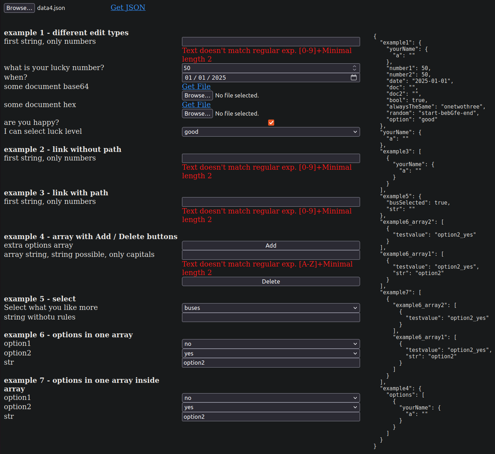

Experimental project with tool for easy creating data JSON files (in future maybe also XML & others) using JSON definitions with info about fields, data format, dependiencies, etc.

This should be better than existing formats, for example [OpenAPI Specification](https://swagger.io/specification/).

# Q&A

**Why JavaScript & not Rust, Java, C, Python, nodeJS, whatever?**
I wanted to have something able to work in browser without
installing anything - the most important was selecting
something adequate to the the task, not something with
all popular, marketing, buzz words (note: JavaScript is not always
very good, I prefer others).

**No AI?** No comments.

**Why not use JavaScript 'eval' and give all options?** I wanted to provide
format for parsing in very secure environments. In theory you can sandbox
JavaScript code, but... (especially non-technical) people can always
see red flag with some keywords & I wanted to avoid it.

**Is it ready?** I think so.

**What's with error handling?** This is not bullet-proof solution. Many errors are shown, but don't expect miracles.

**Why not use anything ready?** All found projects were limited.

**Which browsers?** Tested with desktop Firefox, Chrome/Chromium, Edge.

# Input files

JSON files are describing everything. Typical structure:

    {
        "info": [
            array with strings with info for user
        ],
        "start": [
            section with menu options or links to other sections
        ],
        "other_section_1": [
            section with menu options or links to other sections
        ],
        "other_section_2": [
            section with menu options or links to other sections
        ],
        ...
    }

Non supported elements are ignored.

# Paths in output JSON

Many elements in JSON definion need defining paths in output JSON. Syntax for it is similar to JSON path, but not the same, examples:

1. **array[]** - we don't have index number in brackets and sometimes we create new element in "array" and sometimes we just refer to the whole array (depends on element)
2. **array[1]** - we get second array element
3. **field1.field2.field3** - all elements are separated with dots
4. **array[1].field1**

Additionally in some places we support **$.** in the path definition, for example:

**$.array[1]**

It's important, when user used "link" element in menu (described below).

Many elements are supporting multiple paths - they are separated with comma.

# Field examples

## separator

    ["separator", "example 1 - different edit types"],

First field (**separator**) shows field type, second contains string with section name written in bold. We don't put anything in output JSON.

Note: expandable/collapsable sections can be done with **link** element.

## string

    ["string", "example01.yourName.stringWithNumber,example2.str", "first string, only numbers", "", 2, 10, "[0-9]+"]

This defines string editor. First field is type (always **string**), second contains link to fields in output JSON, third info for user, 4th default string, 5th and 6th minimum and maximum length and 7th regular expression (JavaScript format).

Example of regular expressions:

**[0-9]+** is matching infinite number of digits 0-9 (numbers)

**[a-zA-Z]+** is matching infinite number of small and big Latin letters

## number

    ["number", "example01.int1,example01.int2", "what is your lucky number?", 60, 0, 100, 20]

	["number", "example01.float", "float number", 50.02, 0, 100, 0.02]

Editor definition for number. First field is always **number**, second contains path(s) in output JSON (we save number there), third info for user, 4th default value, 5th and 6th minimum and maximum value, and 7th step.

## date

    ["date", "example01.date", "when?", "2025-01-01", "2024-12-29", "2025-02-02"]

Editor with date. First element is type, than we have path, info for user, default value (when empty, we get current date), minimum and maximum value.

## time

    ["time", "example01.time", "when?", "", "", ""]

Editor with time. First element is type, than we have path, info for user, default value (when empty, we get current time), minimum and maximum value.

## file64, fileHex

    ["file64",  "example01.doc", "some document base64", "T0s=","example",""]

	["fileHex", "example01.doc2", "some document hex", "","", ""]

Editors with file content (Base64 or HexEncoded). Second parameter is path in output JSON, than we have info for user, default value (can be empty), default file name (important, when user didn't uploaded file itself) and filter for file picker (for example: **.jpeg**)

## checkbox, checkfalse
    ["checkbox", "example01.bool", "are you happy?", true]

    ["checkfalse", "example01.bool", "are you tired?", true]

True/false editor. In output JSON we write boolean value (**checkbox**) or reversed boolean value (**checkfalse**).

## const

    ["const","example01.alwaysTheSameConst","onetwothree"]

    ["const","example01.alwaysTheSameConst","onetwothree", true]

No menu for user, just always the same value in JSON. It will be added into JSON:

1. only when doesn't exist (**const** with two params)
2. only when exists (**const** with third param true)

## copy

    ["copy", "example01.bool2", "example01.bool3"]

Copy value from path from parameter 2 to path from last parameter (only when src path exists)

## random

    ["random", "example01.random", "abcdefGHJ", 6,"start-","-end"]

Always new value generated during opening JSON definition file. Third parameter is defining subset of characters, 4th length, 5th and 6th contant prefix and suffix.

## option

    ["option", "example01.option", "I can select luck level", "good", "excellent", "perfect", "good"]

Field with menu for one selection. 4th parameter is defining default value, later we have all possible options.

## multi

    ["multi", "example01.arr[]", "You can more", 1, 2, "good", true, "excellent", false, "perfect", true],

Field with many selections possible. As you can see, we need to define array here (2nd parameter), we have also minimal and maximal number of selected elements and after every element need to say, whether is selected by default or not. In output file we save it into array.

## delete

    ["delete","second_example09_array1[],first_example09_array1[],example09_array2[]"]

**Delete** element will not show any error, when path doesn't exist.

Nice, isn't it?

# Dynamic creating and referencing to array indexes

## addreplace

In output JSON paths sometimes you need ability of addressing dynamically
generated elements in arrays (their index is not known during defining
user menu).

Let's analyse new element **addreplace**.

    ["addreplace","example06_array2[],example06_array1[]"]

    ["addreplace","example09_array1[]", "second_example09_array1[]"]

Element can have two or three elements - second parameter is defining, which array element will be substituted after **addreplace** element (by default we will substitute path like provided in second parameter, we can also give our name in third parameter)

Practical example:

    ["addreplace","example06_array2[],example06_array1[]"]

    ["string", "example09_array2[].firstStr", "first string, only numbers", "", 2, 10, "[0-9]+"],

We will first create new elements in two arrays - one in **example06_array2[]** and one in **example06_array1[]**. Later created index will be used in string parameter - we will save our string in output JSON into **(new created index in the array2).firstStr** path.

Note: replacement works in all further / below elements only.

## index

We can create for user menu element giving ability of selecting one of array indexes:

	["index", "example09.index2toselect", "array index2 to select", "example09_array2[]"]

In second parameter we show, where we save selected index in output JSON. 3rd parameter gives info to user and 4th is selecting, which array is important for us (what is source of indexes).

**Index** element can be saved in version with 3 parameters too and then is normally combined with **addreplace** element, for example:

	["addreplace","first_example09_array1[]"]

	["index", "index2", "first_example09_array1[]"]

This version is taking created index number from array pointed by third parameter and is saving it into path provided by 2nd parameter.

# Link to other sections

## link

This section is sponsored by modularity word. One section in JSON definition file can be used in many places, for example:

    {
        "start: [
            ["link", "", "linksection"],
		    ["link", "example03[]", "linksection"]
        ],
        "linksection": [
            elements
        ]
    }

First **link** element above will not change anything in paths from **linksection**, second will put **example03[].** in their prefix (they will be somehow sandboxed).

    ["link", "", "linksection", "Section name for user"]

**link** element can have (optionally) third parameter string. When it's given, everything inside will be put into expandable/collapsable section.

## select, selectup

    ["select", "option1", "yes", "yes", "option18_yes", "no", "option18_no"]

Another usefull option - we create single selection for user and execute concrete sections after changing value. 3rd parameter shows default value,
after it we define pair of values and executed sections.

Sections will have new **addreplace** values - if you want to include them
into parent use **selectup** instead of **select**

# Arrays with multiple data set

## adddelete

    ["adddelete", "extra array", "id", "example9_delete", "example9_add", true, "example9_add2", true]

We create for user menu with **Add** / **Remove** buttons. True values defines, that both sections will be created during opening (they will not have **Remove** button in the end). When user click **Remove** button, we will call section from 3rd parameter.

Notes:

1. you can put infinite number of add sections (every with true/false of course).

2. all replacements done with **addreplace** from add section will be available in delete section. For deleting them from output JSON you can use **delete** element.

